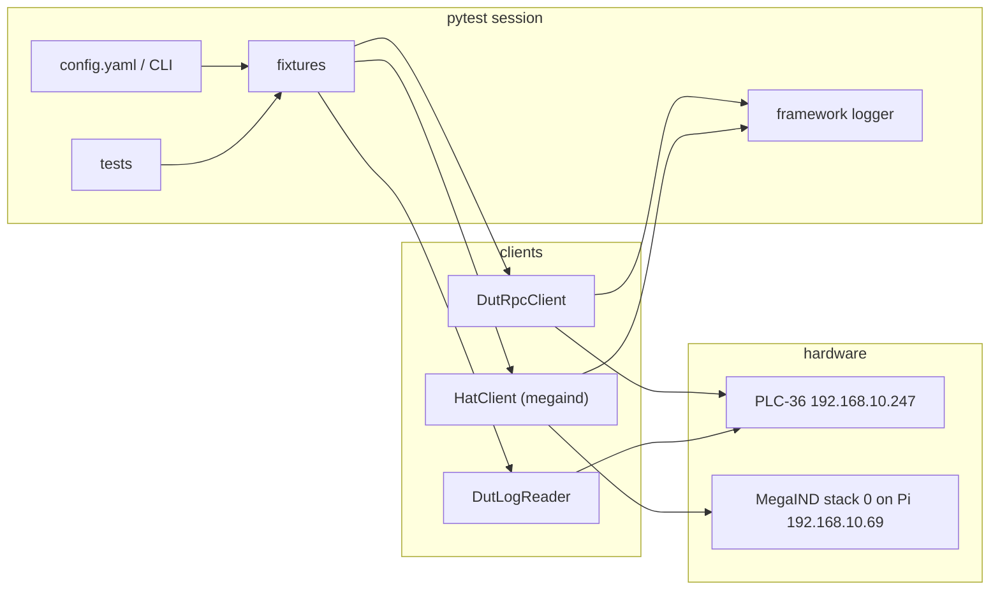
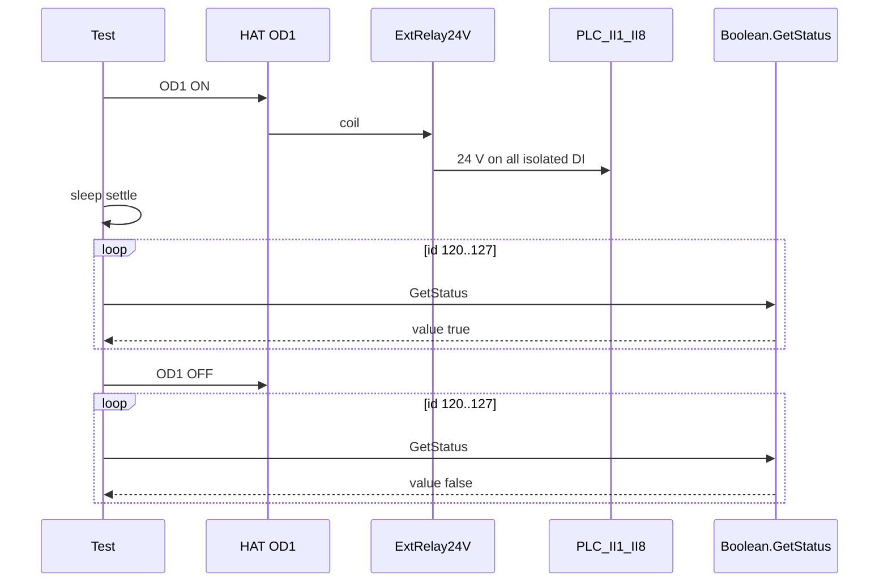
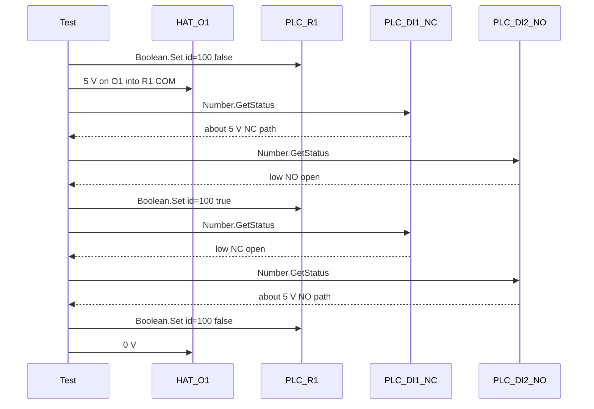
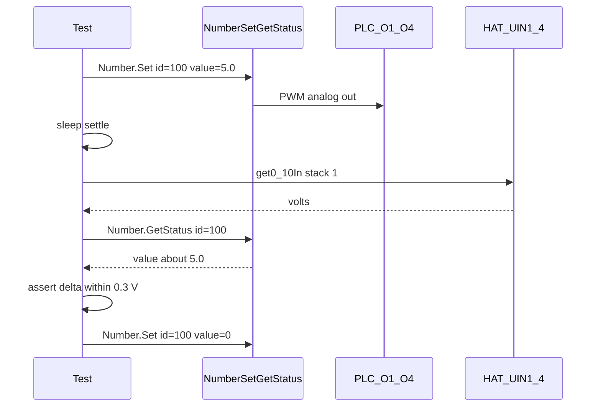
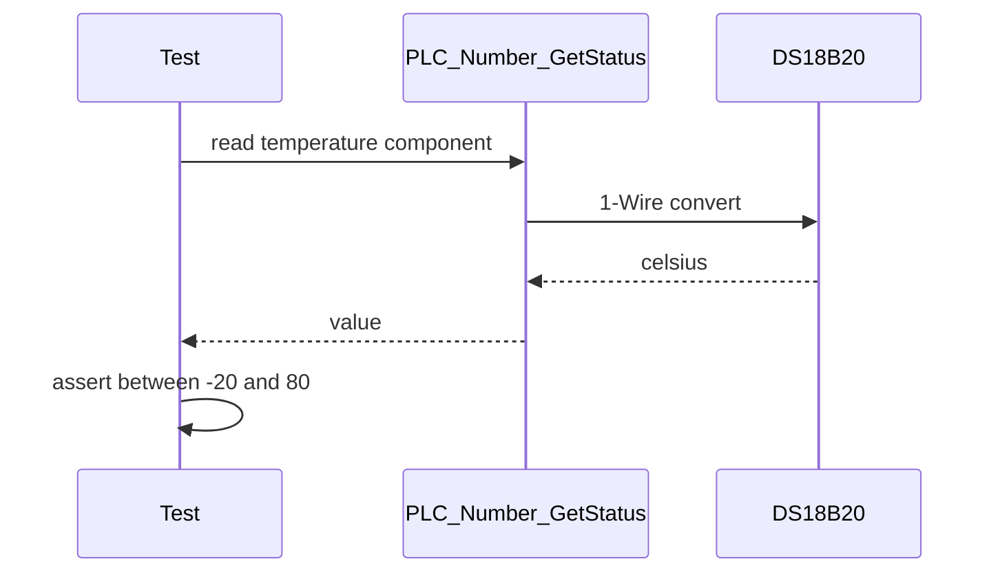
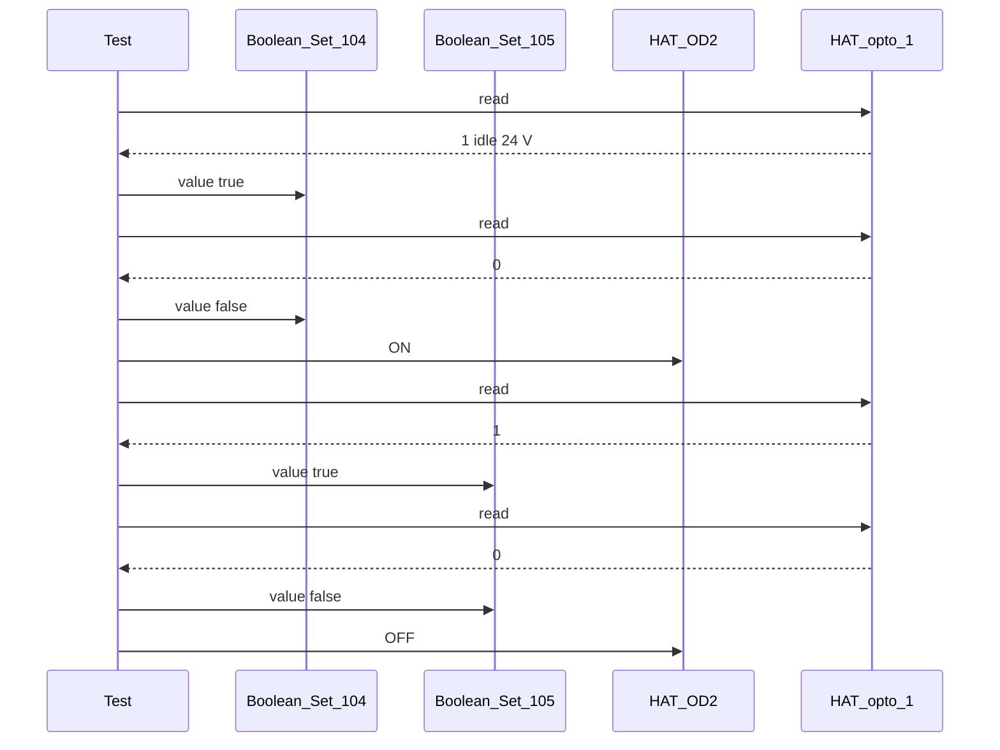
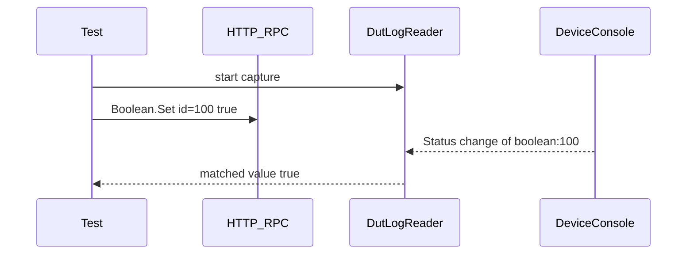

# PLC-36 Pytest Automation Framework Plan

Canonical build plan for a **standalone pytest framework** that exercises a Shelly PLC-36 (DUT) against a Sequent Microsystems Industrial Automation HAT (controller). Covers architecture, code sketches, sequence diagrams, and a first-wave test set for **0–10 V PWM outputs**.

Source wiring notes live in `../../../PLC36_pytest_automation_plan.md` (parent `plc_36` folder).

---

## 1. Goal and scope

### Goal

Drive and observe PLC-36 I/O through public Host RPC, while the HAT injects voltages / digital levels and measures the result. Tests must be repeatable on a fixed bench (`HAT 192.168.10.69`, `DUT 192.168.10.247`).

### In scope (implementation)


| Area        | What to build                                                                           |
| ----------- | --------------------------------------------------------------------------------------- |
| Packaging   | `pyproject.toml` + venv                                                                 |
| DUT RPC     | HTTP JSON-RPC client (`Boolean.*`, `Number.*`, `PLC.*`, `Shelly.*`)                     |
| HAT control | Python `megaind` (`SMmegaind`) wrapping MegaIND stack 0                                 |
| Mapping     | Typed I/O table (virtual component IDs ↔ physical pins ↔ HAT channels)                  |
| Tests       | Isolated DI, MPI + internal relays, 0–10 V outputs, isolated OD outputs, 1-Wire DS18B20 |
| Logging     | Framework structured log + optional DUT log scrape                                      |
| Safety      | Session/module teardown that releases HAT outputs and DUT writeables                    |


### Oute (track, do not implement)

- **4–20 mA loop** — schematic still TBD.
- **RS485** — both terminals may be looped; coprocessor firmware API only, no virtual component.

Modbus (`pymodbus`) is listed as a **library to install** for later `MbRtuClient.`* work. Do not write RS485 tests in the first implementation.

---

## 2. Test environment


| Role             | Device                          | Address          | Access                                                                              |
| ---------------- | ------------------------------- | ---------------- | ----------------------------------------------------------------------------------- |
| Controller / HAT | Sequent MegaIND on Raspberry Pi | `192.168.10.69`  | I2C `megaind` on the Pi (tests run **on the HAT host**, or SSH+I2C if later remote) |
| DUT              | Shelly PLC-36                   | `192.168.10.247` | HTTP `/rpc`                                                                         |


**Assumption:** pytest runs on the Raspberry Pi that has the MegaIND card (stack level `0`). The DUT is Ethernet-reachable from that Pi.

CLI equivalents used on the bench today map to the Python library as follows:


| Bench CLI                   | Python (`import megaind`)      |
| --------------------------- | ------------------------------ |
| `megaind 0 dodwr <ch> 1`    | `megaind.setOdPWM(0, ch, 100)` |
| `megaind 0 dodwr <ch> 0`    | `megaind.setOdPWM(0, ch, 0)`   |
| `megaind 0 uoutwr <ch> <V>` | `megaind.set0_10Out(0, ch, V)` |
| `megaind 0 uinrd <ch>`      | `megaind.get0_10In(0, ch)`     |
| `megaind 0 optord <ch>`     | `megaind.getOptoCh(0, ch)`     |


Use the library in tests; keep CLI only as a debug fallback.

---

## 3. Architecture




Layers:

1. **Inventory** — IPs, stack level, voltage tolerances, settle times.
2. **Clients** — thin wrappers, no pytest knowledge.
3. **I/O map** — named channels (`O1`, `II1`, `physical_ro_0`) so tests never hard-code `number:100`.
4. **Fixtures** — session clients, per-test settle + restore.
5. **Tests** — parametrized over channels.

This repo is **not** a fork of `shelly-test-framework`. Keep it small. Reuse STF ideas (RPC client, structured logs, restore-on-teardown) without importing STF.

---

## 4. Proposed layout

```text
automated-tests-repo/
├── pyproject.toml
├── README.md
├── PLC36_pytest_automation_plan.md              # stub → .cursor/plans/
├── .cursor/plans/
│   └── PLC36_pytest_automation_plan.plan.md     # this file
├── config/
│   └── bench.yaml
├── src/plc36_testkit/
│   ├── __init__.py
│   ├── config.py
│   ├── mapping.py
│   ├── rpc.py
│   ├── hat.py
│   ├── logging.py
│   ├── dut_log.py
│   └── wait.py
├── tests/
│   ├── conftest.py                              # shared session fixtures
│   ├── opto_isolated_inputs/
│   │   └── test_ii1_ii8.py
│   ├── direct_digital_analog_inputs/
│   │   └── test_mpi_and_internal_relays.py      # DI1-DI8 + onboard relays
│   ├── 0V_10V_outputs/
│   │   └── test_variable_outputs.py             # first examples
│   ├── 1_wire_interface/
│   │   └── test_ds18b20.py
│   ├── 4mA_20mA_inputs/
│   │   └── test_current_loop.py                 # skipped placeholder
│   ├── rs485/
│   │   └── test_rs485.py                        # skipped placeholder
│   └── isolated_outputs/
│       └── test_oa_ob.py                        # OA1-OA4, OB1-OB3; not OB4
└── output/                                      # gitignored logs
```

Pytest discovers tests by filesystem path (`testpaths = ["tests"]`), so digit-prefixed folders (`0V_10V_outputs`, `4mA_20mA_inputs`) are valid. Do not import those packages by dotted name.


| I/O family                      | Folder                                |
| ------------------------------- | ------------------------------------- |
| Opto-isolated inputs `II1–II8`  | `tests/opto_isolated_inputs/`         |
| MPI `DI1–DI8` + internal relays | `tests/direct_digital_analog_inputs/` |
| Variable outputs `O1–O4`        | `tests/0V_10V_outputs/`               |
| DS18B20                         | `tests/1_wire_interface/`             |
| Current loop (out of scope)     | `tests/4mA_20mA_inputs/`              |
| RS485 (out of scope)            | `tests/rs485/`                        |
| Isolated OD `OA*` / `OB*`       | `tests/isolated_outputs/`             |


---

## 5. Framework setup

### 5.1 Virtualenv and `pyproject.toml`

```toml
[build-system]
requires = ["setuptools>=61.0"]
build-backend = "setuptools.build_meta"

[project]
name = "plc36-automated-tests"
version = "0.1.0"
description = "Pytest hardware tests for Shelly PLC-36 vs MegaIND HAT"
requires-python = ">=3.10,<4.0"
dependencies = [
    "pytest ~= 8.3.3",
    "pytest-timeout ~= 2.3.1",
    "httpx ~= 0.28.1",
    "pyyaml ~= 6.0",
    "SMmegaind",
    "pymodbus ~= 3.0.0",
]

[project.optional-dependencies]
dev = ["ruff ~= 0.12.5"]

[tool.setuptools.packages.find]
where = ["src"]

[tool.pytest.ini_options]
testpaths = ["tests"]
pythonpath = ["src"]
log_cli = true
log_level = "INFO"
addopts = "-ra --timeout=60"
timeout_method = "thread"
```

Install:

```bash
python3 -m venv .venv
source .venv/bin/activate
pip install -e ".[dev]"
pytest -q --dut-ip 192.168.10.247
```

`SMmegaind` requires I2C on the Pi. Tests that call the HAT should skip when `megaind.getFwVer(0)` fails (CI without hardware).

### 5.2 Bench config

```yaml
# config/bench.yaml
dut:
  ip: 192.168.10.247
  rpc_timeout_s: 10
hat:
  stack: 0
  host_ip: 192.168.10.69
tolerances:
  voltage_v: 0.3          # 0-10 V compare
  mpi_high_v: 3.0         # MPI treated as high
  settle_s: 0.4
onewire:
  min_celsius: -20
  max_celsius: 80
  plausible_room_celsius: [5, 45]
```

CLI overrides: `--dut-ip`, `--hat-stack`, `--config`.

---

## 6. PLC-36 component mapping

Writable virtual components require host control (`CONTROL_HOST_ONLY` / discovered `attrs.access` containing `w`). Otherwise `Boolean.Set` / `Number.Set` must fail or be skipped.


| SDK class                     | Hardware                   | Shelly key      | ID rule    | Tests write?                  |
| ----------------------------- | -------------------------- | --------------- | ---------- | ----------------------------- |
| `PLC36::RelayOutput`          | `RELAY_OUT_1..4`           | `boolean:100+n` | `n` = 0..3 | yes, host-only                |
| `PLC36::OpenDrainOutput`      | `OPEN_DRAIN_OUT_1_1..2_4`  | `boolean:104+n` | `n` = 0..7 | yes, host-only                |
| `PLC36::VariableOutput`       | `VARIABLE_OUT_1..4`        | `number:100+n`  | `n` = 0..3 | yes, host-only (`Number.Set`) |
| `PLC36::MultiPurposeInput`    | `MPI_IN_1..8`              | `number:104+n`  | `n` = 0..7 | read-only                     |
| `PLC36::CurrentInput`         | `CURRENT_LOOP_IN_1..4`     | `number:112+n`  | `n` = 0..3 | read-only; **no tests yet**   |
| `PLC36::IsolatedDigitalInput` | `ISOLATED_DIGITAL_IN_1..8` | `boolean:120+n` | `n` = 0..7 | read-only                     |
| `PLC36::Rs485Interface`       | `RS485_PORT_1..2`          | none            | —          | **no tests**                  |


Convenience names for tests follow the front-panel labels (R, DI, II, O, OA/OB, LP):

```python
# src/plc36_testkit/mapping.py
from dataclasses import dataclass

@dataclass(frozen=True)
class Channel:
    name: str
    key: str  # e.g. "number:100"
    physical: str

    @property
    def rpc_id(self) -> int:
        return int(self.key.split(":")[1])

    @property
    def rpc_type(self) -> str:
        return self.key.split(":")[0]

RELAYS = [Channel(f"R{i+1}", f"boolean:{100+i}", f"physical_ro_{i}") for i in range(4)]
OPTO_ISOLATED_OUTPUTS = [
    Channel(name, f"boolean:{104 + n}", f"physical_odo_{n}")
    for n, name in enumerate(("OA1", "OA2", "OA3", "OA4", "OB1", "OB2", "OB3", "OB4"))
]
OUTPUTS_0_10V = [Channel(f"O{i+1}", f"number:{100+i}", f"physical_ao_{i}") for i in range(4)]
DIRECT_DIGITAL_ANALOG_INPUTS = [
    Channel(f"DI{i+1}", f"number:{104+i}", f"physical_mpi_{i}") for i in range(8)
]
OPTO_ISOLATED_INPUTS = [
    Channel(f"II{i+1}", f"boolean:{120+i}", f"physical_diiso_{i}") for i in range(8)
]
INPUTS_4_20MA = [
    Channel(f"LP{i+1}", f"number:{112+i}", f"physical_i_{i}") for i in range(4)
]  # placeholders only; no tests yet

OA1, OA2, OA3, OA4, OB1, OB2, OB3, OB4 = OPTO_ISOLATED_OUTPUTS  # OB4 not in wiring tests
```

Discovery cross-check (optional session fixture): `Shelly.GetComponents` filtered by `attrs.owner == "plc:0"` and `PLC.GetStatus` `state == "operational"` — same idea as `plc-36-discovery.sh`.

Example RPC (internal relay):

```text
http://192.168.10.247/rpc/Boolean.Set?id=100&value=true
http://192.168.10.247/rpc/Boolean.Set?id=100&value=false
```

---

## 7. Client sketches

### 7.1 DUT RPC

```python
# src/plc36_testkit/rpc.py
from __future__ import annotations

import logging
from typing import Any

import httpx

log = logging.getLogger("framework.plc36")


class DutRpcError(RuntimeError):
    pass


class DutRpcClient:
    def __init__(self, ip: str, timeout_s: float = 10.0) -> None:
        self._url = f"http://{ip}/rpc"
        self._http = httpx.Client(timeout=timeout_s)

    def call(self, method: str, params: dict[str, Any] | None = None) -> Any:
        payload = {"id": 1, "method": method, "params": params or {}}
        log.info("RPC %s %s", method, params)
        resp = self._http.post(self._url, json=payload)
        resp.raise_for_status()
        body = resp.json()
        if body.get("error"):
            raise DutRpcError(f"{method}: {body['error']}")
        log.debug("RPC result %s", body.get("result"))
        return body.get("result")

    def number_set(self, cid: int, value: float) -> None:
        self.call("Number.Set", {"id": cid, "value": value})

    def number_get_status(self, cid: int) -> float:
        return float(self.call("Number.GetStatus", {"id": cid})["value"])

    def boolean_set(self, cid: int, value: bool) -> None:
        self.call("Boolean.Set", {"id": cid, "value": value})

    def boolean_get_status(self, cid: int) -> bool:
        return bool(self.call("Boolean.GetStatus", {"id": cid})["value"])

    def plc_get_status(self, cid: int = 0) -> dict[str, Any]:
        return self.call("PLC.GetStatus", {"id": cid})

    def close(self) -> None:
        self._http.close()
```

`Number.Set` / `Boolean.Set` return `null` on success. Status shape:

```json
{"value": 5.0, "source": "rpc", "last_update_ts": 1700864253}
```

### 7.2 HAT client

```python
# src/plc36_testkit/hat.py
from __future__ import annotations

import logging

import megaind

log = logging.getLogger("framework.hat")


class HatClient:
    def __init__(self, stack: int = 0) -> None:
        self.stack = stack

    def od_on(self, ch: int) -> None:
        log.info("HAT OD%d ON", ch)
        megaind.setOdPWM(self.stack, ch, 100)

    def od_off(self, ch: int) -> None:
        log.info("HAT OD%d OFF", ch)
        megaind.setOdPWM(self.stack, ch, 0)

    def set_uout(self, ch: int, volts: float) -> None:
        log.info("HAT UOUT%d = %.3f V", ch, volts)
        megaind.set0_10Out(self.stack, ch, volts)

    def read_uin(self, ch: int) -> float:
        v = float(megaind.get0_10In(self.stack, ch))
        log.info("HAT UIN%d = %.3f V", ch, v)
        return v

    def read_opto(self, ch: int) -> int:
        bit = int(megaind.getOptoCh(self.stack, ch))
        log.info("HAT OPTO%d = %d", ch, bit)
        return bit

    def all_safe(self) -> None:
        for ch in range(1, 5):
            self.od_off(ch)
            self.set_uout(ch, 0.0)
```

---

## 8. I/O connections and tests

### 8.1 Opto-isolated inputs (II1-II8)

HAT Open Drain 1 drives an **external relay** that applies **24 V to all `II1–II8` at once**. There is currently **no per-channel isolation** on the bench.


| Stimulus             | PLC                                                       | HAT                         |
| -------------------- | --------------------------------------------------------- | --------------------------- |
| OD1 ON (`dodwr 1 1`) | `II1`–`II8` (`boolean:120`–`127`, `physical_diiso_0`–`7`) | Open Drain 1 → relay → 24 V |
| OD1 OFF              | all II expected `false`                                   |                             |





Test files: `tests/opto_isolated_inputs/`. Sketch: one parametrized test over `OPTO_ISOLATED_INPUTS`, plus one gang test that asserts all eight change together (documents the wiring limitation).

### 8.2 Direct digital-analog inputs (DI1-DI8) and onboard relays

Each HAT 0–10 V output feeds one onboard relay **COM**. The relay **NC** pin goes to the odd DI of the pair; **NO** goes to the even DI. The same pattern repeats for all four pairs.

Example: HAT O1 → `R1` COM; `R1` NC → `DI1`; `R1` NO → `DI2`.


| HAT | Relay (idle = NC)                  | NC → DI            | NO → DI            | RPC |
| --- | ---------------------------------- | ------------------ | ------------------ | --- |
| O1  | `R1` `boolean:100` `physical_ro_0` | `DI1` `number:104` | `DI2` `number:105` |     |
| O2  | `R2` `boolean:101` `physical_ro_1` | `DI3` `number:106` | `DI4` `number:107` |     |
| O3  | `R3` `boolean:102` `physical_ro_2` | `DI5` `number:108` | `DI6` `number:109` |     |
| O4  | `R4` `boolean:103` `physical_ro_3` | `DI7` `number:110` | `DI8` `number:111` |     |


With HAT O1 at 5 V:


| `R1`                                      | `DI1` (NC) | `DI2` (NO) |
| ----------------------------------------- | ---------- | ---------- |
| idle (`Boolean.Set` `id=100` `false`)     | ~5 V       | low / open |
| energized (`Boolean.Set` `id=100` `true`) | low / open | ~5 V       |


The same idle/energized swap applies to `R2`–`R4` with HAT O2–O4 and `DI3`–`DI8`.




Tests live in `tests/direct_digital_analog_inputs/`. Assert both sides of each pair so a stuck relay is visible.

### 8.3 Outputs 0-10 V PWM (O1-O4) — first example cases

Set PLC variable outputs; read HAT analog inputs IN1–IN4.


| PLC | RPC                   | HAT read          |
| --- | --------------------- | ----------------- |
| O1  | `Number.Set` `id=100` | `get0_10In(0, 1)` |
| O2  | `Number.Set` `id=101` | IN2               |
| O3  | `Number.Set` `id=102` | IN3               |
| O4  | `Number.Set` `id=103` | IN4               |





Suggested setpoints: `0.0`, `5.0`, `10.0` (and optionally `2.5`, `7.5`). Tolerance from `bench.yaml` (`0.3 V` starting point; tune on the real bench). Tests live in `tests/0V_10V_outputs/`.

### 8.4 One-Wire (DS18B20)

Sensor is wired **directly on the PLC**. There is **no HAT involvement**. Tests live in `tests/1_wire_interface/`.

Implementation approach (until a dedicated 1-Wire RPC exists in public docs):

1. Session: `Shelly.GetComponents` / `PLC.GetStatus` and find a temperature-bearing status field, **or** a virtual `number` owned by PLC that reports °C.
2. Assert value is finite and in `[min_celsius, max_celsius]`.
3. Soft assert room-plausible range as a warning, not a hard fail, if the chamber is uncontrolled.

If firmware exposes temperature only in device logs, scrape logs (section 10) as a last resort — prefer RPC.




### 8.5 4-20 mA

**Do not implement.** Keep a skipped placeholder in `tests/4mA_20mA_inputs/test_current_loop.py` so collection documents the gap:

```python
@pytest.mark.skip(reason="4-20 mA bench schematic not finalized")
def test_current_loop_placeholder() -> None:
    pass
```

Channels reserved: `number:112`–`115` (`CURRENT_LOOP_IN_1..4`).

### 8.6 RS485

**Do not implement.** `pymodbus` is a dependency only. Place a skipped test in `tests/rs485/test_rs485.py`: RS485 loopback / coprocessor API TBD.

### 8.7 Isolated outputs (OA / OB)

Isolated OD outputs **idle at 24 V** into HAT opto inputs. **Asserting `physical_odo_X` removes voltage**; HAT opto reads **0**. Tests live in `tests/isolated_outputs/`.

Shared HAT opto channels and extra relays:


| PLC | Physical                       | HAT measure | Extra                     |
| --- | ------------------------------ | ----------- | ------------------------- |
| OA1 | `physical_odo_0` `boolean:104` | `optord 1`  | direct                    |
| OA2 | `physical_odo_1` `boolean:105` | `optord 1`  | HAT OD2 drives ext. relay |
| OA3 | `physical_odo_2` `boolean:106` | `optord 2`  | direct                    |
| OA4 | `physical_odo_3` `boolean:107` | `optord 2`  | HAT OD3 ext. relay        |
| OB1 | `physical_odo_4` `boolean:108` | `optord 3`  | direct                    |
| OB2 | `physical_odo_5` `boolean:109` | `optord 3`  | HAT OD4 ext. relay        |
| OB3 | `physical_odo_6` `boolean:110` | `optord 4`  | direct                    |
| OB4 | `physical_odo_7`               | —           | **not tested**            |


Pair logic (OA1/OA2 on HAT opto 1):

1. Idle: `optord 1` → **1**.
2. Trigger OA1: `optord 1` → **0**.
3. Release OA1, `dodwr 2 1`: `optord 1` → **1** (relay path).
4. Trigger OA2 with OD2 still on: `optord 1` → **0**.

Same pattern for OA3/OA4 (opto 2 + HAT OD3) and OB1/OB2 (opto 3 + HAT OD4). OB3 is direct on opto 4.




**Order:** tests that share an opto input must **not run in parallel**. Default `pytest-xdist` off. Module-level lock or `pytest.mark.serial` if parallelism is added later.

---

## 9. Example test cases — 0-10 V outputs

```python
# tests/0V_10V_outputs/test_variable_outputs.py
from __future__ import annotations

import time

import pytest

from plc36_testkit.mapping import OUTPUTS_0_10V

SETPOINTS = (0.0, 5.0, 10.0)


@pytest.fixture(autouse=True)
def restore_vout(dut, hat, bench):
    yield
    for ch in OUTPUTS_0_10V:
        dut.number_set(ch.rpc_id, 0.0)
    hat.all_safe()


@pytest.mark.parametrize("channel,hat_in", list(zip(OUTPUTS_0_10V, (1, 2, 3, 4), strict=True)))
@pytest.mark.parametrize("volts", SETPOINTS)
def test_variable_output_matches_hat_uin(dut, hat, bench, channel, hat_in, volts):
    dut.number_set(channel.rpc_id, volts)
    time.sleep(bench.tolerances.settle_s)

    reported = dut.number_get_status(channel.rpc_id)
    measured = hat.read_uin(hat_in)
    tol = bench.tolerances.voltage_v

    assert reported == pytest.approx(volts, abs=tol)
    assert measured == pytest.approx(volts, abs=tol)
```

Session fixtures (`tests/conftest.py`):

```python
@pytest.fixture(scope="session")
def dut(bench):
    client = DutRpcClient(bench.dut.ip, bench.dut.rpc_timeout_s)
    status = client.plc_get_status()
    if status.get("state") != "operational":
        pytest.skip(f"PLC not operational: {status}")
    yield client
    client.close()


@pytest.fixture(scope="session")
def hat(bench):
    client = HatClient(bench.hat.stack)
    try:
        megaind.getFwVer(bench.hat.stack)
    except Exception as exc:
        pytest.skip(f"MegaIND not available: {exc}")
    yield client
    client.all_safe()
```

Markers to add: `hardware`, `analog`, `digital`, `onewire`, `needs_host_control`.

---

## 10. Logging

### 10.1 Framework logger

Initialize in `pytest_configure`:

- Root logger `framework` for the testkit (handlers, format, level).
- Child `framework.hat` for MegaIND / HAT I/O.
- Child `framework.plc36` for DUT RPC (`Number.*`, `Boolean.*`, `PLC.*`, `Shelly.*`).
- File: `output/test_execution.log` (create `output/`).
- Format: `[ts] | LEVEL | channel | message`.
- On failure: dump last N HAT / PLC-36 lines to `output/fail_<nodeid>.log`.
- CLI: `--log-to-stdout`, `--framework-log-level`.

```python
# src/plc36_testkit/logging.py
import logging
from pathlib import Path

def init_logging(level: str = "INFO", to_stdout: bool = False) -> None:
    Path("output").mkdir(exist_ok=True)
    fmt = "%(asctime)s | %(levelname)-7s | %(name)-16s | %(message)s"
    handlers: list[logging.Handler] = [
        logging.FileHandler("output/test_execution.log", encoding="utf-8"),
    ]
    if to_stdout:
        handlers.append(logging.StreamHandler())
    root = logging.getLogger("framework")
    root.setLevel(level)
    root.handlers.clear()
    formatter = logging.Formatter(fmt)
    for handler in handlers:
        handler.setFormatter(formatter)
        root.addHandler(handler)
    root.propagate = False
```

HAT code logs on `framework.hat`. DUT RPC logs on `framework.plc36`. Both propagate to `framework`. Log every HAT write and every RPC request/response (info for writes, debug for full JSON).

### 10.2 Device logs

DUT console lines look like:

```text
y_notifications.cpp:168 Status change of boolean:100: {"source":"rpc","value":false}
shos_rpc_inst.c:241     Number.Set [23@web-...] via WS_in from 192.168.10.62:57114
y_notifications.cpp:168 Status change of number:102: {"source":"rpc","value":49}
```

Use device logs as **diagnostics**, not as the primary assertion (RPC + HAT are source of truth).

Possible collectors (try in this order):

1. HTTP debug log endpoint if enabled on the build (`/debug/log` or equivalent).
2. WebSocket notifications (`NotifyStatus`) correlated with `last_update_ts`.
3. Optional serial/SSH capture if the bench exposes console.

Helper: after `Boolean.Set id=100`, poll DUT log / WS until a line contains `boolean:100` and `"value":true`, with timeout. Keep this behind `--capture-dut-logs` so default runs stay RPC+HAT only.




---

## 11. Safety and isolation

1. **Session start:** `hat.all_safe()`, all `Number.Set` analog outs `0`, all writable booleans `false` (or documented idle). Isolated OD idle is **24 V present** — do not force false if that **is** the energized wiring; restore to **firmware idle** instead.
2. **Each test:** restore channels it touched.
3. **Session end / Ctrl-C:** `pytest` fixture finalizer still runs `hat.all_safe()`.
4. **Host control:** if `Number.Set` / `Boolean.Set` returns an error (component not host-writable), skip with a clear message rather than fail the whole class.
5. **Shared opto pairs:** one test at a time; no xdist.

---

## 12. Implementation phases


| Phase     | Deliverable                                                                                    |
| --------- | ---------------------------------------------------------------------------------------------- |
| **0**     | Repo skeleton: `pyproject.toml`, `config/bench.yaml`, clients, mapping, logging, `conftest.py` |
| **1**     | `tests/0V_10V_outputs/test_variable_outputs.py` on real bench; tune voltage tolerance          |
| **2**     | Isolated DI gang test in `tests/opto_isolated_inputs/` (`II1–II8`)                             |
| **3**     | DI NC path in `tests/direct_digital_analog_inputs/` (relays idle)                              |
| **4**     | DI NO path + `R1`–`R4` in the same folder (relays energized)                                   |
| **5**     | Isolated OD pairs in `tests/isolated_outputs/` (except OB4)                                    |
| **6**     | 1-Wire temperature sanity in `tests/1_wire_interface/`                                         |
| **7**     | DUT log capture (optional flag)                                                                |
| **Later** | Fill `tests/4mA_20mA_inputs/` and `tests/rs485/` once schematics are ready                     |


Do not start phase 5 until phase 1 pass/fail is stable — analog settle time teaches the wait helper used everywhere.

---

## 13. Open questions

1. **Where pytest runs** — confirmed on HAT Pi, or a PC talking to Pi over SSH/HTTP for MegaIND?
2. **1-Wire RPC** — exact `Shelly.GetComponents` key for DS18B20.
3. **Idle polarity of isolated OD** — confirm `Boolean.Set true` breaks the 24 V vs inverted firmware mapping.
4. `**CONTROL_HOST_ONLY**` — is it a `PLC.SetConfig` flag or a firmware build default?
5. **4–20 mA / RS485 schematics** — still blocked.
6. **OB4** — permanently unwired, or future work?

---

## 14. Run command (target)

```bash
source .venv/bin/activate
pytest tests/0V_10V_outputs/test_variable_outputs.py \
  --dut-ip 192.168.10.247 \
  --log-to-stdout \
  -k "volts==5"
```

